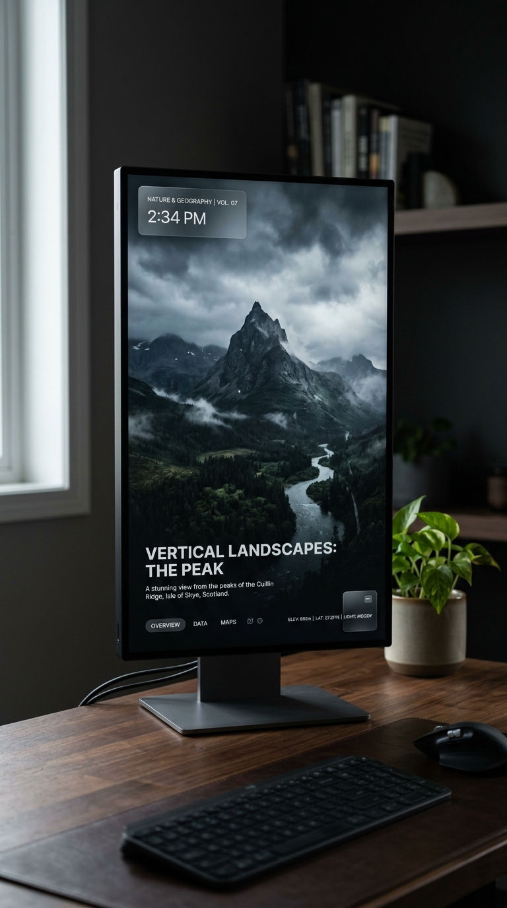

# 1440x3440.com 🖼️

> The ultimate digital frame specialized for 1440x3440 and 3440x1440 vertical portrait monitors. Zero latency, zero footprint, zero ads.



## Why this exists

I had a spare 1440x3440 monitor rotated vertically. Finding good vertical wallpapers was a pain. Existing wallpaper engine apps were too heavy, consumed too much SSD space, or were loaded with ads.

So I built **PortraitFrame**. It's an insanely lightweight, borderless desktop app that fetches curated, high-quality vertical art directly from a Cloudflare R2 bucket and caches it strictly to RAM. It just works.

## Features

- **Zero Footprint**: Streams images directly to memory. Doesn't hoard your SSD space.
- **Zero Ads**: No subscriptions, no ads. Just pure 60fps aesthetic.
- **Auto-Sync**: Automatically fetches the latest curated playlist from the cloud.
- **Keyboard Shortcuts**: Minimalist design. No ugly UI buttons. Everything is controlled via keyboard.

## Download

Get the latest stable release for Mac and Windows at [1440x3440.com](https://1440x3440.vercel.app/).

## Keyboard Controls

| Key | Action |
|-----|--------|
| `→` / `←` | Next / Previous Image |
| `SPACE` | Pause / Play Slideshow |
| `TAB` | Toggle Options Menu |
| `R` | Shuffle Mode |
| `S` | Sequential Mode |
| `ESC` | Exit Fullscreen / Close App |

## Architecture

- **Client App**: Python + PyQt6 (Packaged into `.app` and `.exe` via PyInstaller)
- **Cloud Storage**: Cloudflare R2 for fast, distributed image streaming
- **Web Portal**: Next.js 14 + React (Deployed on Vercel)
- **CI/CD**: GitHub Actions for automated cross-platform binary builds

## Build from Source

```bash
# 1. Create virtual environment
python -m venv .venv
source .venv/bin/activate

# 2. Install dependencies
pip install -r requirements.txt

# 3. Run the viewer
python viewer.py
```

## Support

If this ridiculously specific app saved your spare monitor from gathering dust, consider helping with the cloud server costs!
[☕ Buy me a coffee](#)
